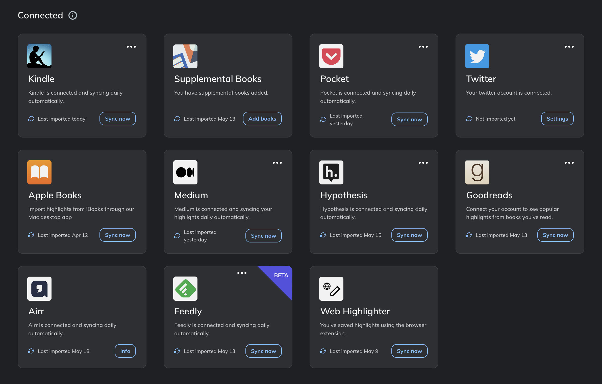
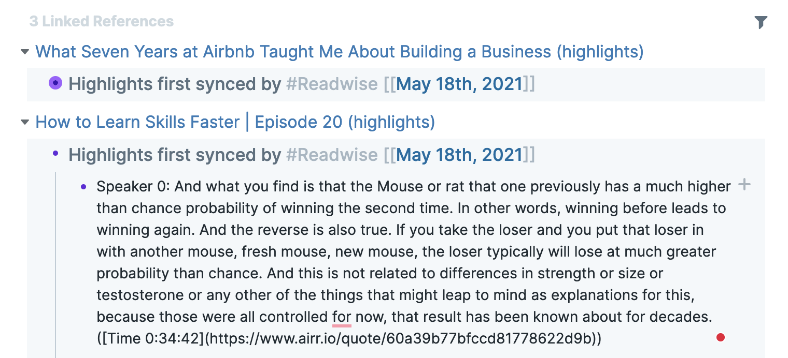

Listening to podcasts is a great way to learn. It's a shame that taking notes of the most insightful information we hear forces us to pick up our phones or look for our pens and journals. It's disturbing and sometimes not even possible, especially while driving a car or having our hands occupied in any other way. Luckily, there are services and apps that make this process fully automatic, without requiring us to type a word.

## What we can achieve

Imagine going for a walk with AirPods in your ears. You hear something very insightful. You press a button on a headphone. The valuable sentence you just heard is saved as text in your note-taking system (alongside the link to the podcast episode with the exact timing of the quote).

Sounds cool, doesn't it? It's pretty easy to achieve by integrating a few services and an app on our phone.

## First step - Airr

[Airr](https://www.airr.io/) is a podcast player that allows taking so-called **AirrQuotes**. AirrQuotes are highlights of the best moments we hear in podcasts. When we hear something insightful, all we need to do is to press a button on AirPods (applies to Apple AirPods users - for other hardware users, you'll probably have other options).

Airr allows exporting all the AirQuotes automagically to other services, alongside text transcription of the quote. It all happens automatically, without requiring us to trigger export manually.

## Second step - Readwise

[Readwise](https://readwise.io/) is an extremely useful service. It's a hub for highlights and notes from other systems - note something in Kindle, take AirrQuote in Podcast app, highlight something in RSS reader - all of this can be automatically ingested by Readwise and stored in one place. [Steps for integrating it with Airr are extremely simple](https://help.readwise.io/article/103-how-do-i-save-highlights-from-the-podcasts-i-listen-to-using-airr).

Right now, I'm exporting highlights from 8 apps and services to my Readwise hub.

But, what is the most important, Readwise also allows exporting everything we ingest automatically to other systems (e.g. note-taking apps) like Notion, Evernote, Roam etc.

## Third step - note-taking app

I use Readwise to export all my notes (including AirrQuotes from podcasts, which are stored safely in my Readwise) to the best note-taking (it's an understatement) app in this world - [Roam](https://roamresearch.com/) (I'm not sorry for this biased, strong opinion. Roam rulez).

All we need to do to set up the integration is to sign up and follow easy steps from the manual, which takes less than a minute. This process will depend on what app you use to store your notes. In my case, it looked like [this](https://help.readwise.io/article/71-how-does-the-readwise-to-roam-export-integration-work).

## Enjoy

That's it. Having it all done, we can reward ourselves by going for a walk, listening to a podcast, and taking notes of the best insights with a single button click on our earphone.

